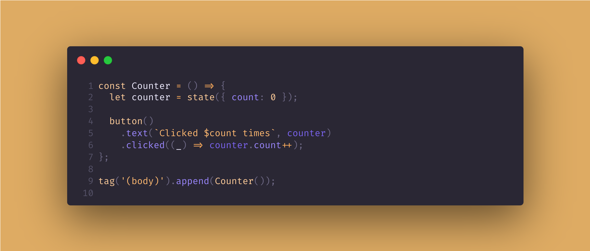

## 📦 Carboard.js




[](https://github.com/nombrekeff/cardboard-js/actions/workflows/test_main.yml)
[](https://github.com/nombrekeff/cardboard-js/milestone/1)
[](https://sonarcloud.io/summary/new_code?id=nombrekeff_cardboard-js)
[](https://github.com/nombrekeff/cardboard-js/milestone/1)


**Cardboard.js: Build web apps without HTML, CSS, or JSX!** This lightweight (_around 16kb_), performant library lets you manage state, components, and logic using just JavaScript/TypeScript. Ideal for projects where simplicity and speed are key.

It's similar in philosophy to [VanJS](https://vanjs.org/), but with many more features and a more extensive API.

> **!NOTE!**: Cardboard is [in development](https://github.com/nombrekeff/cardboard-js/wiki/Project-Status), use it with caution.  
> You can check the [v1.0.0 milestone](https://github.com/nombrekeff/cardboard-js/milestone/1) for a view on the development state - **help is much appreciated!**

```ts
const Counter = () => {
  const count = state(0);

  return button()
    .text(`Clicked $count times`, { count })
    .addStyle('color', 'gray')
    .stylesIf(count.greaterThan(5), { color: 'red' }) // If count > 5, it will make the color red
    .clicked((_) => count.value++);
};

// Counter will be added to the body
tag('(body)').append(Counter());
```

#### 🔸 [Getting Started](https://github.com/nombrekeff/cardboard-js/wiki/Getting-Started) - for a getting started guide.
#### 🔸 [Wiki](https://github.com/nombrekeff/cardboard-js/wiki/Examples) - for human documentation, and examples.
#### 🔸 [Deepwiki](https://deepwiki.com/nombrekeff/cardboard-js/1-overview) - ai generated docs using deepwiki
#### 🔸 [Documentation](https://nombrekeff.github.io/cardboard-js/) - for technical docs.

### Setup
#### Install

```
npm install @nkeff/cardboard-js
```

#### Setup

```ts
import { tag, init, allTags } from '@nkeff/cardboard-js';
// Or
import { tag, init, allTags } from 'node_modules/@nkeff/cardboard-js/dist/cardboard.js';

const { div, p, span, b, script, button, style, a, hr } = allTags;

// Initialize and get access to the root tag ('body' by default)
const body = init();

// Add tags to the body
body.append(
  div(
    p('Hello world!')
  )
);
```

#### Single file script

If you want to add it to your site and start using Cardboard, you can import the bundle file:

**Global import:**
```html
<script src="node_modules/@nkeff/cardboard-js/dist/cardboard.global.js"></script>
<!-- Or using a CDN -->
<script src="https://cdn.jsdelivr.net/npm/@nkeff/cardboard-js/dist/cardboard.global.js"></script>
<script>
const { div, p } = Carboard.allTags;
</script>
```

**ESM import:**
```html
<script>
  import { tag, init, allTags, p } from 'https://cdn.jsdelivr.net/npm/@nkeff/cardboard-js/dist/cardboard.js';
  const { div, p } = allTags;
</script>
```


### What does it do?

Cardboard.js lets you create web apps using only JavaScript/TypeScript, eliminating the need for HTML, CSS, or JSX. Write code that directly represents your HTML, CSS, state, and logic.

**Key features:**
*   **[NO HTML](https://github.com/nombrekeff/cardboard-js/wiki/Tags)**: Create any HTML element with Cardboard.
*   **[State](https://github.com/nombrekeff/cardboard-js/wiki/State)**: Built-in reactive state management.
*   **[Manipulation](https://github.com/nombrekeff/cardboard-js/wiki/Manipulating-Tags)**: Easily manipulate HTML properties based on state.
*   **[Logic](https://github.com/nombrekeff/cardboard-js/wiki/Logic)**: Add application logic in a simple way.
*   **[Text Templates](https://github.com/nombrekeff/cardboard-js/wiki/Text-Templates)**: Simplify text and template manipulation with state.
*   **[Components](https://github.com/nombrekeff/cardboard-js/wiki/Reusable-Component)**: Create reusable UI components.
*   **[CSS in JS](https://github.com/nombrekeff/cardboard-js/wiki/Styling)**: Style your application using JavaScript objects.
*   **Typed**: Full TypeScript support for code completion and type safety.
*   **ATAP**: As tested as possible!

----
> NOTE: There's also a server-side alternative to **Cardboard** I've also written, called [**Hobo**](https://github.com/nombrekeff/hobo-js). In case you need something similar to Cardboard that works server-side!
> I'm planning to make Cardboard work server-side as well in v2.0.0. So you can look forward to that, or help out!
----

### Who's this for?

If you don't like writing HTML, CSS, or JSX, or need a lightweight framework for performant web apps, Cardboard.js might be for you. Build anything from static pages to advanced applications with a small footprint. Let me know if it's missing something you need!

### Contributing

Well, hello! I'm always open for help on projects, and this one in particular! If you find the project interesting, useful, fun, or you feel some other kind of emotion, and that emotion inclines you to maybe consider helping out, that'd be great! 

You can help with the Wiki, using and testing the project, reporting bugs, fixing bugs, adding features, etc... Just remember to leave an issue if the change is big or changes some core concept of cardboard.

Take a look at these guides:
* [Development Project Setup](https://github.com/nombrekeff/cardboard-js/wiki/Development-Guide)
* [Contributing Guide](https://github.com/nombrekeff/cardboard-js/wiki/Contributing-Guide)


