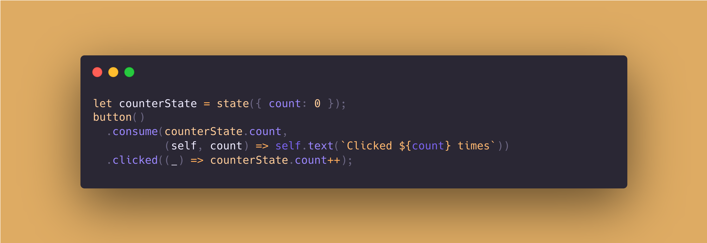

## Carboard.js





Welcome to Carboard. A very simple, yet powerful "framework"/library to create web applications without the need to write any HTML.

NOTE: There's also a server-side companion to **Cardboard** I've written, called [**Hobo**](https://github.com/nombrekeff/hobo-js) in case you need to generate HTML as string in the server.

### Who's this for?

If you don't like writing HTML, or need a very basic framework for simple apps, Cardboard might be for you!

### What does it do?

It let's you write javascript code instead of HTML. It hass a simple API to do anything you want with the HTML elements, like adding styles, attributes, events...
It's lightweight, and very simple.

### Getting Started
Install package: 

```
npm install https://github.com/nombrekeff/cardboard
```

Then you  can import the package. 

```ts
import { tag, init, allTags, state, attached, hinput, hstyle } from 'cardboard';
const { div, button, input, a, ul, li, hr, style } = allTags;

init({ root: 'body' }); // By calling init, any new tag added will be added to the "body" (passing root selector is optional, 'body' by default)
```

I recomend destructuring tags, for a cleaner code:

```ts
const { div, p, span, b, script, button, style, a, hr } = allTags;
```

### Examples

Check out the [`examples`](/examples) folder for a variety of examples on how to use Cardboard.

#### Clicker Example

```ts
let counterState = state({ count: 0 });
button()
  .consume(counterState.count, (self, count) => self.text(`Clicked ${count} times`))
  .clicked((_) => counterState.count++);
```

Let me explain:
```ts
let counterState = state({ count: 0 });
```
> Creates a "reactive" state, or more so a state that can be listened to, globaly or per property.
> `counterState.changed((newState) => handleStateChange())`  
> `counterState.count.changed((newValue) => handleValueChange())`

```ts
button()
```
> `button()` or any other tag method for that matter, generates an HTMLElement in the page. To the body by default, but this can be changed. Check [Attaching](#attaching) further down.
> If you don't want the tag to be automatically added, you can call `button.silent()` instead. This will just return the tag and let you handle it.

```ts
.consume(counterState.count, (self, count) => self.text(`Clicked ${count} times`))
```
> the `.consume` method, reacts to changes in the state, and triggers the **callback**.
> For example in the snippet above, whenever `counterState.count` changes, we set the **text** to `"Clicked ${count} times"`.
> That will automatically change the innerContent of the HTML element.

```ts
.clicked((_) => counterState.count++);
```
> the `.clicked` method will be called, whenever the element is clicked. Quite simple!
> it's a shortcut for `.on('click', callback);`, a couple of shorthands are provided. 
> If the event you want to listen does not have a shorthand, you can either, leave an issue for me to add it, send a PR or just use `.on(evtName, callback);`.


#### Todo Example
```ts
const list = ul.silent().addAttrs({ id: 'list' });
const itemInput = hinput({ placeholder: 'Enter item content', submit: (_) => addItem() });

const addItem = () => {
  if (itemInput.value) {
    list.add(li.silent(itemInput.value).clicked((self) => self.remove()));
    itemInput.clear();
  }
};

button('Add item').clicked(addItem);
attached().add(list);
```

Let me explain:
```ts
const list = ul.silent().addAttrs({ id: 'list' });
```
> Create a **ul** list, with an id "list". But, it will not be automatically added to the DOM as we've called `.silent()`. We must handle adding it later.

```ts
const itemInput = hinput({ placeholder: 'Enter item content', submit: (_) => addItem() });
```
> `hinput` is a custom component that makes working with inputs easier. It internally generates a input element, configured with the options provided.
> In this case we set the **placeholder** and sets the `submit` event, which will be triggered when the enter key is pressed.

```ts
const addItem = () => {
  if (itemInput.value) {
    list.add(li.silent(itemInput.value).clicked((self) => self.remove()));
    itemInput.clear();
  }
};
```
> Little method to handle adding items to the list. It will also clear the input.
> To add an iten to the list, it's possible by calling `.add()` with the element we want.
> A `li` in this case, with the value of the input as it's text.

```ts
button('Add item').clicked(addItem);
```
> Creates a button, which will add an item when it's clicked.

```ts
attached().add(list);
```
> `attached()` returns the currently attached element (body by default), read more about it i nthe [Attaching](#attaching) section below.
> `.add(list)` will add the list element created above to the attached element.

#### Component Example
You can also create reusable components, quite simply. Check this example out:

```ts
export type HInputOptions = {
  value?: string;
  placeholder?: string;
  tooltip?: string;
  silent?: boolean;
  change?: EventCallback<'change'>;
  submit?: (tag: HoboTag, evt: Event) => void;
};

export function hinput(options: HInputOptions = {}) {
  const el = options.silent == true ? input.silent() : input();

  el.config({
    attr: { tooltip: options.tooltip, placeholder: options.placeholder },
    on: {
      change: options.change,
      submit: options.submit,
      keypress: (tag, evt) => {
        if (evt.key == 'Enter') {
          options.submit(tag, evt);
        }
      },
    },
    value: options.value ?? '',
  });

  return el;
}
```
> It basically simplifies the creation of an input element, and adds some logic.
> It can then be used as any other cardboard tag method.
> `hinput({...})`


### Attaching

Cardboard by default will not be attached to anything. So when you create elements nothing will appear in the page. If you want to be able to automatically add items to some parent element, you must first initialize Carboard by calling the `init()` function.

If no arguments are passed to init, it will automatically attach to the body. You can also pass a selector of the element you want to attach to.

```ts
init();
init({ root: '#app-root' });
```

You can also manually attach to any element by calling the `attach()` function:
```ts
init();
const wrapper = div();
attach(wrapper);

p();
span();
```
> `p()` and `span()` will be added as children of wrapper.

It's also possible to attach multiple times:
```ts
init();
const wrapper = div();
attach(wrapper);
const childDiv = div("I'm inside wrapper");

attach(childDiv);
p("I'm inside child div!");
detach();

p("I'm now inside wrapper!");
```

