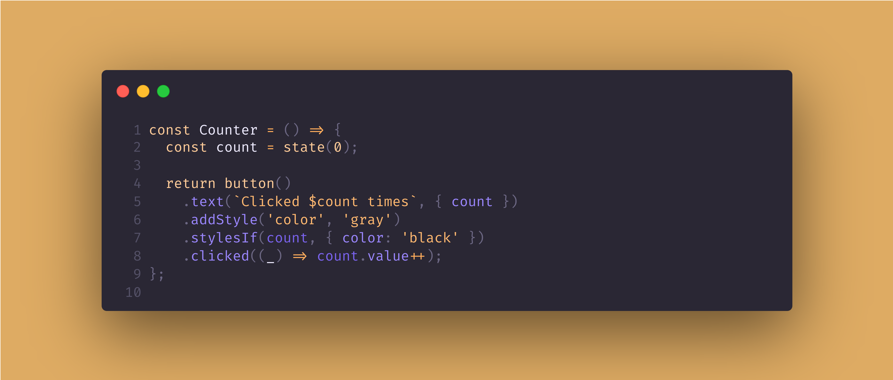

## 📦 Carboard.js




[](https://github.com/nombrekeff/cardboard-js/actions/workflows/test_main.yml)
[](https://github.com/nombrekeff/cardboard-js/wiki/Project-Status)

Welcome to Cardboard. An **extremely light**, **performant**, and **very simple** reactive framework. It offers almost everything you'd expect from a complete framework. Like, managing reactive state, full control over the elements, logic, and much more. See **[what it can do](https://github.com/nombrekeff/cardboard-js#what-does-it-do)**.

It's similar in philosophy to [VanJS](https://vanjs.org/), if that rings a bell, but with many more features. And a more flexible and intuitive API.

> **!NOTE!**: Cardboard is [in development]((https://github.com/nombrekeff/cardboard-js/wiki/Project-Status)), use it with caution.  
> You can check the [project](https://github.com/users/nombrekeff/projects/2) for a vision of what's coming for v1.0.0 - help is much appreciated! 


```ts
const Counter = () => {
  const count = state(0);

  return button()
    .text(`Clicked $count times`, { count })
    .addStyle('color', 'gray')
    .stylesIf(count, { color: 'black' }) // If count > 0, it will make the color black
    .clicked((_) => count.value++);
};

// Counter will be added to the body
tag('(body)').append(Counter());
```


### Getting Started
#### Install

```
npm install https://github.com/nombrekeff/cardboard-js
```
#### Setup

```ts
import { tag, init, allTags } from 'cardboard-js';
// Or
import { tag, init, allTags } from 'node_modules/cardboard-js/dist/cardboard.js';

const { div, p, span, b, script, button, style, a, hr } = allTags;

const root = attach(tag('(body)'));

root.append(div(p('Hello world!')));
```

#### Single file script
If you just want to add it to your site and start using Cardboard, you can import the bundle file:
```html
<script src="node_modules/cardboard-js/dist/bundle/cardboard.bundle.js"></script>
<script>
const { div, p } = Carboard.allTags;
</script>
```

#### 🔸 [Getting Started](https://github.com/nombrekeff/cardboard-js/wiki/Getting-Started) - for a getting started guide.
#### 🔸 [Wiki](https://github.com/nombrekeff/cardboard-js/wiki/Examples) - for human documentation, and examples.
#### 🔸 [Documentation](https://nombrekeff.github.io/cardboard-js/) - for technical docs.

### What does it do?

Cardboard allows you to create reactive web apps without needing to write any **HTML**. It works without using **JSX** or having a build/compile process (_unless you use TS_). **Everything is plain JS**. It's very lightweight and extremely performan by design. 

The philosophy is to be able to create fully functional and performat web apps using just JS. No HTML, no CSS, no JSX, nothing. Just JS or TS. Instead of writing **HTML** and then creating JS that interacts with the **HTML**, and adding CSS to style. You directly write JS that represents both the **HTML**, CSS, state, and logic. 

It offers a **[state](#state) management** solution out of the box. The concept is similar to react. You create a state, then use the state as a value, and whenever the state changes it automatically updates that value. 

Here is a list of some of the features it offers (_there are more though_):
* **[NO HTML](https://github.com/nombrekeff/cardboard-js/wiki/Tags)**: You don't need to write those nifty little angle brackets anymore! You can create any HTML with Cardboard.
* **[State](https://github.com/nombrekeff/cardboard-js/wiki/State)**: Out-of-the-box reactive state.
* **[Manipulation](https://github.com/nombrekeff/cardboard-js/wiki/Manipulating-Tags)**: Manipulate any HTML properties of any element, manually and based on state. i.e. adding classes, showing/hiding elements, removing styles, listening to events, and much more...  
* **[Logic](https://github.com/nombrekeff/cardboard-js/wiki/Logic)**: Add logic in a very ergonomic and simple way.
* **[Text Templates](https://github.com/nombrekeff/cardboard-js/wiki/Text-Templates)**: Easy text and template manipulation when working with states.
* **[Components](https://github.com/nombrekeff/cardboard-js/wiki/Reusable-Component)**: You can create reusable components, like in any other framework.
* **[Tweening](https://github.com/nombrekeff/cardboard-js/wiki/Tweening)**: Extremely simple tweening out of the box.
* **[Routing](https://github.com/nombrekeff/cardboard-js/wiki/Routing)**: Create single page apps like a breeze.
* **[CSS in JS](#css-in-js)**: You can create `style` tags, and write the CSS directly as a JS object.
* **Typed**: Cardboard aims to be 100% typed, meaning it will suggest any suggestable properties, methods, etc...(i.e. style `properties`, etc...)
* **ATAP**: As tested as possible!

Cardboard offers all of this in a very small package with a very simple API. As it is plain JS it's possible to learn in a very short amount of time. And you can build apps very fast when you get the hang of it. It can be used both in JavaScript and TypeScript.


----
> NOTE: There's also a server-side alternative to **Cardboard** I've also written, called [**Hobo**](https://github.com/nombrekeff/hobo-js). In case you need something similar to Cardboard that works server-side!
> I'm planning to make Cardboard work server-side as well in v2.0.0. So you can look forward to that, or help out!
----

### Who's this for?

If you don't like writing HTML, CSS or JSX, like me. Or need a simple and lightweight framework that can do most things that bigger frameworks can do with a smaller footprint, while being very performant, Cardboard might be for you! Cardboard can be used to build anything from a static page to more advanced apps, like dashboards. It should be able to do most things!

But it's perfect for when you want to create a very small page where you need a reactive framework and you need to create it fast. 

### Backstory

I'm not going to lie, I didn't expect I'd be writing this when I first started writing Cardboard. It was supposed to be a little experiment for another project of mine ([Hobo](https://github.com/nombrekeff/hobo-js)) that I thought would fail.  
What was the experiment? I hear you asking. Well, it was just to make [Hobo](https://github.com/nombrekeff/hobo-js) work with the DOM, instead of rendering HTML as a string. It's funny how things play out sometimes! We never know when we're going to build something to be proud of. 

> You can read an article I made on [how I made the initial draft of cardboard](https://dev.to/nombrekeff/from-concept-to-reality-my-process-of-building-cardboard-40fb)!

I will not tell you the full story but know that Cardboard started as an experiment meant to fail. But for some reason, every piece started to fit perfectly with one another, 
until today, where Cardboard could be considered functional. Not finished though, it's still a lot of work before that point. That takes us to you. I, hopefully, ask you to consider helping out. Let's make Cardboard worth it's contents ;)

**Why the name?**: Funny story, well not really. It's named Cardboard to keep on the brand of Hobo. But you could think it's named that, because, like cardboard, it's useful, light, versatile and cheap. 

### Contributing

Well, hello! I'm always open for help on projects, and this one in particular! If you find the project interesting, useful, fun, or you feel some other kind of emotion, and that emotion inclines you to maybe consider helping out, that'd be great! 

You can help with the Wiki, using and testing the project, reporting bugs, fixing bugs, adding features, etc... Just remember to leave an issue if the change is big or changes some core concept of cardboard.

Take a look at these guides:
* [Development Project Setup](https://github.com/nombrekeff/cardboard-js/wiki/Development-Guide)
* [Contributing Guide](https://github.com/nombrekeff/cardboard-js/wiki/Contributing-Guide)


